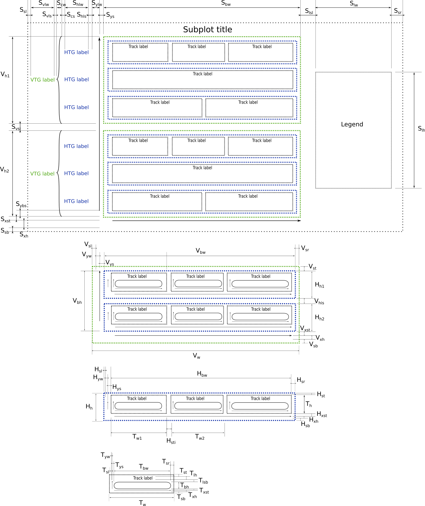

# Main drawing objects (nested, from top to bottom)

1. Figure (Maybe remove)
2. Subplot
3. VerticalTrackGroup
4. HorizontalTrackGroup
5. Track

# Figure scheme

1. Dimensions of the subplot:
   1. Horizontal dimensions
      1. Ssl   - left space 
      2. Svlw  - width of the vertical track group label 
      3. Svls  - space between vertical track group label and connector between labels
      4. Scw   - connector width
      5. Scs   - space between connector and horizontal track group label
      6. Shlw  - width of horizontal track group label 
      7. Shls  - space between horizontal track group label and subplot's Y axis
      8. Sylw  - width of Y axis (including ticks and label)
      9. Sys   - space between Y axis and vertical track groups
      10. Svw  - width of vertical track groups
      11. Slsl - space between vertical track groups and legend
      12. Slw  - width of the legend
      13. Ssr  - right space
   2. Vertical dimensions
      1. Svh1  - height of the first vertical track group
      2. Svs   - space between vertical track groups
      3. Svh2  - height of the second vertical track group
      
          ..................................................................
   
      4. Svhn  - height of the last vertical track group
      5. Sybs  - distance between left bottom corner of the last vertical track group and start of the subplot's Y axis
      6. Sxst  - space between the last vertical track group and subplot's X axis 
      7. Sxh   - height of the subplot's X axis (including ticks and label)
      8. Ssb   - bottom space
2. Dimensions of the vertical track group
   1. Horizontal dimensions
      1. Vsl   - left space 
      2. Vyw   - width of the vertical track group's Y axis (including ticks and label)
      3. Vys   - space between vertical track group's Y axis and horizontal track groups
      4. Vhw   - width of the horizontal track groups 
      5. Vsr   - right space
      6. Vw    - whole width of the vertical track groups
   2. Vertical dimensions
      1. Vst   - top space
      2. Vhh1  - height of the first horizontal track group
      3. Vhis  - space between horizontal track groups
      4. Vhh2  - height of the second horizontal track group
    
         .....................................................................

      5. VVhhn  - height of the last horizontal track group
      6. VVxst  - space between the last horizontal track group and vertical track group's X axis 
      7. VVxh   - height of the X axis (including ticks and label)
      8. VVsb   - bottom space
3. Dimensions of the horizontal track group
   1. Horizontal dimensions
      1. Hsl   - left space
      2. Hyw   - width of the horizontal track group's Y axis (including ticks and label)
      3. Hys   - space between horizontal track group's Y axis and first track
      4. Htw1  - width of the first track 
      5. Hsti  - space between tracks
      6. Htw2  - width of the second track
    
         .....................................................................

      7. Htwn  - width of the last track
      8. Hsb   - right space
   2. Vertical dimensions
      1. Hst   - top space
      2. Hht   - height of the tracks
      3. Hxst  - space between tracks and horizontal track group's X axis 
      4. Hxh   - height of the horizontal track group's X axis (including ticks and label)
      5. Hsb   - bottom space
4. Dimensions of the track
   1. Horizontal dimensions
      1. Tsl   - left space
      2. Tyw   - width of the track's Y axis (including ticks and label)
      3. Tys   - space between track's Y axis and track body
      4. Tbw    - width of the track body
      5. Tsr    - right space
   2. Vertical dimensions
      1. Tst   - top space
      2. Tlh   - height of the track label
      3. Tlsb  - space between track label and track body
      4. Tbh    - height of the  track body
      5. Txst  - space between track bodies and track's X axis 
      6. Txh   - height of the tracks' sX axis (including ticks and label)
      7. Tsb   - bottom space

# Formulas:

*Track width* Tw = Tsl + Tyw + Tys + Tbw +  Tsb

| dimension | Tsl       | Tyw  | Tys   | Tbw | Tsb |
|-----------|----------------------|-----------------|------------------|----------------|----------------|
| source    | style                | auto from style | style            | data           | style          |
| values    | fraction* | fraction        | fraction         | absolute       | fraction       |

\* fraction of max (Tbw)

*Track height* Th = Tst + Tlh + Tlsb + Tbh + Txst  + Txh + Tsb

| dimension | Tst | Tlh   | Tlsb | Tbh | Txst | Txh  | Tsb |
|-----------|----------------|------------------|-----------------|----------------|-----------------|-----------------|----------------|
| source    | style          | auto from style  | style           | data           | style           | auto from style | style          |
| values    | absolute       | absolute         | absolute        | absolute       | absolute        | absolute        | absolute       |

*Horizontal track group width* Hw = Hsl + Hyw + Hys + sum(Twi) + (N-1)* Hsti + Hsr

| dimension | Hsl       | Hyw  | Hys | Twi | Hsti | Hsr |
|-----------|----------------------|-----------------|----------------|----------------|-----------------|----------------|
| source    | style                | auto from style | style          | data           | style           | style          |
| values    | fraction* | fraction        | fraction       | absolute       | fraction        | fraction       |

\* fraction max(sum(Tbw) per horizontal track group) 

*Horizontal track group height* Hh = Hst + Hht + Hxst + Hxh + Hsb

| dimension | Hst | Hht     | Hxst | Hxh  | Hsb |
|-----------|----------------|--------------------|-----------------|-----------------|----------------|
| source    | style          | max(Th) | style           | auto from style | style          |
| values    | absolute       | absolute           | absolute        | absolute        | absolute       |

