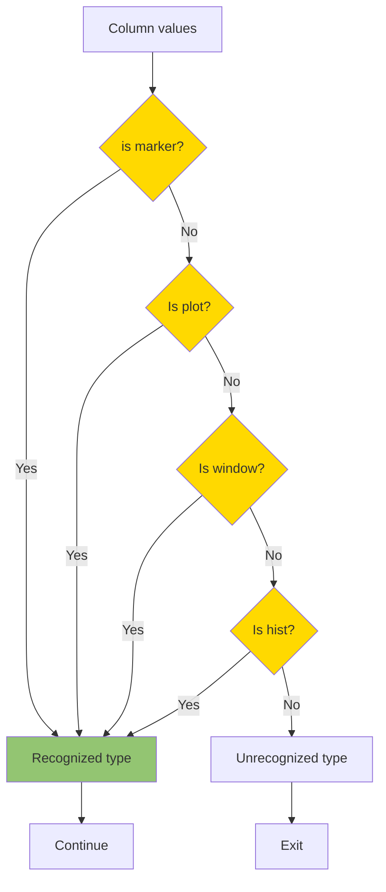
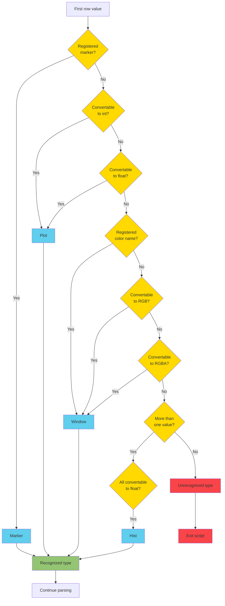

# General track format

MACE uses an extended BED format for storing tracks. 
It is a tab-separated format with first three columns containing id of scaffold, start and end of the 
region (zero-based coordinate system with half-open intervals, i,.e python-style notation.). The rest of columns contain track-specific values and modifiers.
A track file may contain multiple tracks of various types. 
First row of the file must start from '#' symbol and contain a header with column names.

**Header structure:**

```
#scaffold_id    start   end track1&type1 track1&par1 ... track1&parK ... trackN&typeN trackN&par1 ... trackN&parM
```
**Header fields**

| Column        | Description         | Values                                                   | Comment                                                                                                                                                                                                                       |
| ------------- |---------------------|----------------------------------------------------------|-------------------------------------------------------------------------------------------------------------------------------------------------------------------------------------------------------------------------------|
| scaffold_id | Id of the scaffold  | single str | NA                                                                                                                                                                                                                            |
| start | start of the region | single int | 0-based, start is included in the  region                                                                                                                                                                                     |
| end | end of the region   | single int | 0-based, end is not included in the region                                                                                                                                                                                    |
| track1&type1 | Track values for 'track1' | comma-separated list of values (str, float, int or bool) | Column name encodes type of the track. See **Allowed types of the tracks** for details. By default, *&* is used as separator between *track name* and *track type*                                                            |
| track1&par1 | Values for 'par1' of 'track1' | comma-separated list of values (str, float, int or bool) | Column name encodes parameter of the track. It should include *track name* and *parameter name*, separated by *&*. See **Recognizable track parameters** for details. If parameter is absent in the list, it will be ignored. |

**Track types:**

Some track types may include several internal separators (zero, one or more) "$" if it is necessary to set a specific subtype or features of the track or additional parameters.
See **Allowed types of the tracks** for tracks supporting such settings.  

**Attached tracks:**

In some cases you may need to draw one track (query) over other one (target).
For this just add **@target_track_name** to the query track after the type.
If you wish to attach several query tracks to a single target track, then you will need  specify a query-target chain for each of queries in the order of drawing.  

*Example.* Two marker_m query tracks attached to the hist track. Query track with rectangle markers will be drawn last:

AAAAA<strong>&</strong>hist - target

BBBBB<strong>&</strong>marker_m<strong>@</strong>AAAAA - query attached to the target AAAAA

CCCCC<strong>&</strong>marker_m<strong>@</strong>BBBBB - query2 attached to the same target AAAAA, but will be drawn after query 1

**Allowed types of the tracks:**
1. **hist**          - use a full height of a track to plot a stacked histogram. Sum of components must not exceed 1.00 in any window. Use a script "prepare_hist_for_tracks.py" to prepare your values for the track.
2. **window**        - use a full height and width of the region to plot a rectangle.
3. **plot**          - draw a curve over whole track. By default, points of curve localize at the middle of the region. Allows subtypes. See track_types/plot.md for details
4. **marker**        - draw markers. By default, markers localize at the middle of the region. Allows subtypes. See track_types/marker.md for details


**Recognizable track parameters** implemented so far:
1. **colors** - comma-separated list of matplotlib color names or color hexs or keywords ("default") 
2. **bg_color** - matplotlib color name or color hex or keyword ("default")
3. **height_offset** - height offset for the center of the marker. Fraction or keyword ("default")

**Keywords**:
1. **default** - use default from the script (vary from script to script)


**Example**:
```
#scaffold_id	start	end	admixture&hist	admixture&colors	admixture&bg_color	het&window	het&colors	roh&bool	roh&colors
HiC_scaffold_1	0	1000000	0.496093,0.503907	#377EB8,#FF7F00	white	1.035	#00D4FF	False	default
HiC_scaffold_1	100000	1100000	0.497003,0.502997	#377EB8,#FF7F00	white	1.119	#00D4FF	False	default
HiC_scaffold_1	200000	1200000	0.497429,0.502571	#377EB8,#FF7F00	white	1.159	#00D4FF	False	default
```

# Automatic detection of the track type

If track type is not specified in the column name, MACE can try to automatically detect it.
It will try to check all the types one by one:


More detailed diagram:

